# 1. Introducción

## ¿Qué es Proxmox VE?

Proxmox Virtual Environment o Promxox VE, es un entorno de virtualización de servidores de código abierto. Es una distribución de linux basada en Debian, con una versión del Kernel de Ubuntu LTS modificada. Permite el despliegue y gestión de máquinas virtuales y contenedores desde una consola web. Gracias a esta consola, los usuarios pueden gestionar máquinas virtuales, contenedores y almacenamiento definido por software.
Dentro de Proxmox existen dos tipos de virtualización compatibles, los contenedores basados en LXC (Linux Containers) y la virtualización con KVM (Kernel-based-Virtual Machine) para las máquinas virtuales. Todo esto es posible gracias a la implementación de hipervisores KVM y LXC para crear y gestionar entornos virtuales. Los usuarios tienen la capacidad de desplegar múltiples máquinas virtuales y contenedores en un solo servidor físico, optimizando así el uso de recursos. La interfaz web permite a los usuarios realizar tareas como la creación, clonación y migración de VMs, así como la configuración de redes y almacenamiento.

## Principales características y ventajas

### Características

Dentro de Proxmox VE existen gran cantidad de características, pero principalmente las más comunes son:
- **Virtualización KVM y LXC:** Soporte completo para KVM, permitiendo la ejecución de máquinas virutales con gran rendimiento y LXC para contenedores ligeros.
- **Gestión de clústeres:** Permite la creación y gestión de clústeres de múltiples nodos, mejorando la escalabilidad y redundancia del sistema
- **Alta disponibilidad (HA):** Ofrece capacidades de alta disponibilidad para VM y CT, asegurando que los servicios críticos permanezcan operativos incluso en caso de fallos en el hardware.
- **Interfaz de usuario Web:** Proporciona una interfaz de usuario intuitiva y completa basada en web para la administración de todos los aspectos del entorno virtualizado.
- **Copia de seguridad y Restauración:** Incluye herramientas integradas para realizar copias de seguridad y restaurar VM y CT de manera eficiente
- **Integración con ZFS:** Soporte para el sistema de archivos ZFS, proporcionando capacidades avanzadas de gestión de almacenamiento, instantáneas y recopilación.
- **Redes definidas por software (SDN):** Facilita la configuración y gestión de redes virtuales complejas dentro del entorno de Promxox VE.
- **Soporte para varios sistemas operativos:** Permite la ejecución de múltiples sistemas operativos, incluyendo Windows, Linux y otros.

### Ventajas

Adicionalmente, Proxmox ofrece varias ventajas frente a otras soluciones de virtualización como Hyper-V de Microsoft o ESXi de VMWare:
- **Coste eficiente:** Proxmox, al ser de código abierto, elimina la necesidad de adquirir una licencia con un precio elevado, lo que puede reducir significativamente los costos operativos. Esto es especialmente beneficioso para instituciones y empresas que buscan maximizar su presupuesto en TI.
- **Flexibilidad y Escalabilidad:** La capacidad de gestionar tanto máquinas virtuales como contenedores permite a las organizaciones adaptar sus infraestructuras a diferentes necesidades de cargas de trabajo. Además, la facilidad para añadir nuevos nodos al clúster permite escalar la infraestructura de manera eficiente según se necesite.
- **Mejora de disponibilidad y resiliencia:** Las características de alta disponibilidad y la gestión de clústeres aseguran que los servicios críticos permanezcan en línea incluso en caso de fallos de hardware. Esto es crucial para las empresas que requieren una operación continúa y sin interrupciones.
- **Simplificación de la gestión de TI:** La interfaz web de Proxmox facilita la administración de toda la infraestructura virtual de un solo punto de control. Esto simplifica las tareas de administración para los equipos de TI, permitiendo una gestión más eficiente y reduciendo la carga operativa.
- **Capacitación y educación:** Proxmox es una plataforma ideal para la enseñanza de tecnologías de virtualización y administración de sistemas. Los estudiantes pueden aprender a configurar y gestionar entornos virtuales reales, preparándolos para el mercado laboral.


# 2. Requisitos e Instalación

## Hardware mínimo recomendado

Proxmox requiere un hardware adecuado par aun rendimiento óptimo frente a cargas de trabajo exigentes. 

A continuación se detallan los requisitos mínimos recomendados para **funciones básicas:**
- **CPU:** Procesador con arquitectura de 64 bits con soporte para virtualización
- **RAM:** 8 GB mínimo para poder ejecutar máquinas virtuales y contenedores
- **Almacenamiento:** 16 GB en SSD o HDD (Preferiblemente SSD)
- **Red:** Tarjeta de red gigabit (1Gbps)

Para entornos de producción o cargas de trabajo exigentes, se recomienda:
- **CPU:** Procesador multinúcleo moderno (Intel Xeon o AMD EPYC recomendados)
- **RAM:** 16 GB o más (32 GB o más para alta disponibilidad y grandes cargas)
- **Almacenamiento:**
    - SSD NVMe para el sistema y almacenamiento rápido
    - RAID o ZFS con redundancia para mayor seguridad
- **Red:** Tarjetas de red de 10 Gbps si se requiere alto rendimiento

## Descarga e instalación de Proxmox VE

### Descargar Proxmox VE

Para poder obtener la última versión de Proxmox VE:
1. Visitar la página oficial de Proxomox: https://www.proxmox.com/downloads
2. Descargar la imagen ISO más reciente para Proxmox VE

Una vez tenemos la imagen ISO descargada, debemos crear un medio de instalación con un USB, mediante rufus o herramientas similares:

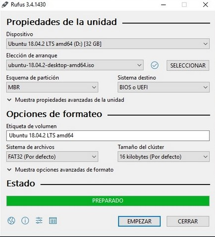

### Instalación de Proxmox VE

Seguidamente instalamos el USB en el servidor dónde queremos instalar PROXMOX y seleccionamos el USB como método de arranque desde nuestra BIOS o UEFI. Para acceder al menú de arranque es importante mirar la marca de nuestra placa base ya que dependiendo de un modelo u otro la tecla para acceder al menú de arranque puede variar (F2, F9, Del).

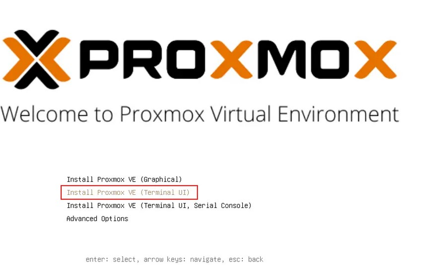


***Se recomienda realizar una instalación mediante GUI ya que es más intuitiva y fácil de interpretar. Para realizarlo desde terminal se precisan conocimientos más avanzados***

Los siguientes pasos son:
1. Configurar un disco dónde se instalará Proxmox
2. Configurar una red asignado una IP fija o mediante DHCP para el servidor de Proxmox
3. Finalizar la instalación siguiendo los pasos que se ven en pantalla

Para comprobar que la instalación se ha realizado correctamente, reiniciamos y accedemos vía navegador:
- `https://<IP-del-servidor>:8006`

# 3. Gestión de Máquinas Virtuales (VMs) y Contenedores (LXCs)

## Diferencias entre VMs y LXCs

### ¿Qué es una Máquina Virtual (VM)?

Una máquina virtual o VM en Proxmox es un sistema operativo, completamente virtualizado, que se ejecuta sobre un hipervisor (QEMU/KVM en el caso de Proxmox). La VM tiene su propio Kernel, sistema operativo y recursos virtuales asignados, como CPU, RAM y almacenamiento. Es independiente del sistema anfitrión y se comporta como una computadora física.

### ¿Qué es un contenedor LXC?

Un contenedor linux o LXC  es una tecnología de virtualización a nivel de sistema operativo. En lugar de emular hardware, los contenedores comparten el kernel del sistema anfitrión (Proxmox). Cada contenedor es un entorno aislado con su propio sistema de archivos, usuarios, procesos y red, pero sin la sobrecarga de una VM completa.

### Principales diferencias entre VMs y LXCs

| **Característica**      | **VM (KVM/QEMU)** 🖥️                                                      | **Contenedor LXC** 📦                                           |
|:----------------------- | ------------------------------------------------------------------------- | --------------------------------------------------------------- |
| **Virtualización**      | Completa (Hardware Emulado)                                               | Basada en contenedores (Comparten kernel)                       |
| **Uso del Kernel**      | Tiene su propio kernel                                                    | Comparte el kernel del host                                     |
| **Rendimiento**         | Mayor consumo de recursos                                                 | Más eficiente en rendimiento                                    |
| **Aislamiento**         | Alto (Como una máquina virtual)                                           | Medio (Depende del kernel del host)                             |
| **Compatiblidad SO**    | Cualquier SO                                                              | Solo Linux                                                      |
| **Consumo de RAM /CPU** | ALTO                                                                      | BAJO                                                            |
| **Migración**           | Más compleja y requiere recursos                                          | Más rápida y sencilla                                           |
| **Gestión de recursos** | Totalmente independiente                                                  | Más flexible pero dependiente del host                          |
| **Casos de Uso**        | Aplicaciones que requieren alto aislamiento, sistemas operativos variados | Entornos ligeros, aplicaciones Linux, servicios en contenedores |
**Se recomienda usar VMs en caso de ejecutar Windows o distribuciones Linux con total independencia. Son ideales para aplicaciones críticas, bases de datos y entornos que requieren aislamiento total.**

**Se recomienda usar LXCs en caso de ejecutar servicios o aplicaciones Linux con un menor consumo de recursos y una gestión más sencilla. Son ideales para servidores web, bases de datos ligeras y entornos de desarrollo.**


## Creación de una máquina virtual (VM)

A continuación veremos el proceso de crear una máquina virtual dentro de un nodo de Proxmox paso a paso, completamente detallado con capturas del proceso.

**Paso 1:** 

Accedemos a nuestro entorno de proxmox `https://<ip>:8006`

**Paso 2:** 

Accedemos a nuestro nodo:

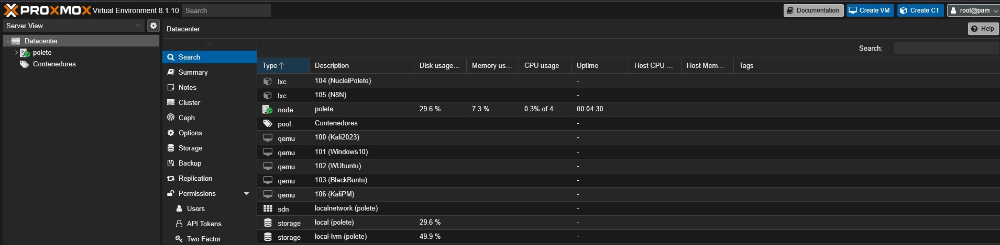


**Paso 3:** 

Accedemos a la parte de "Create VM":

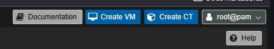


**Paso 4:**

Se abrirá una ventana dentro del entorno para configurar la creación de nuestra máquina virtual:

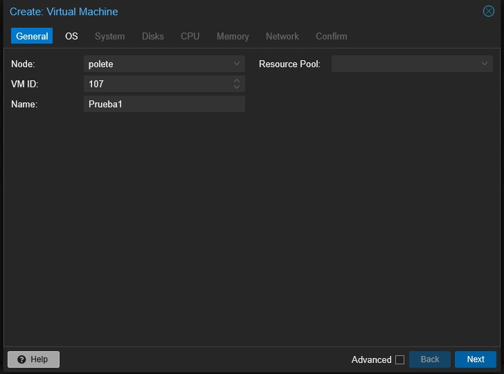


Seguidamente configuramos el sistema operativo de nuestra VM mediante una imagen ISO:

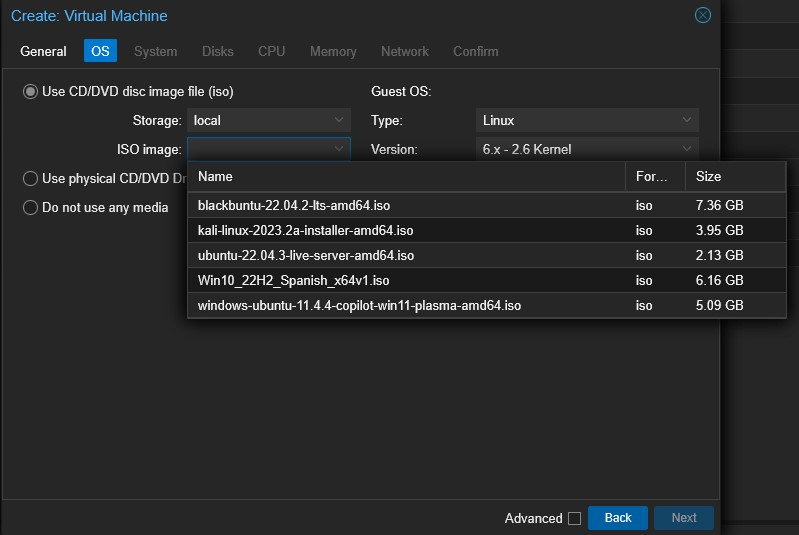


**Proxmox trae por defecto ciertas imágenes ISO configuradas en el sistema, si queremos cargar o añadir una ISO adiiconal debemos hacerlo de la siguiente manera:**

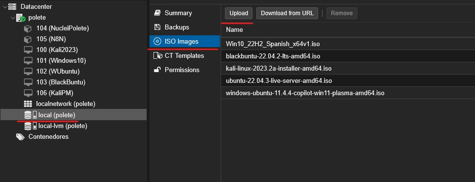


En mi caso crearé una VM con una imagen de Kali Linux:

Le damos a siguiente hasta llegar a esta ventana de configuración:

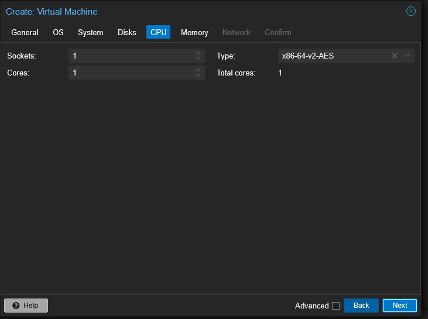


En esta sección, dependiendo de los sockets de nuestra CPU y núcleos podemos configurar un valor u otro. Si añadimos más núcleos y sockets a la VM, esta tendrá mayor velocidad de procesamiento.

Seguidamente debemos configurar la memoria RAM, otro parámetro que dependerá de las capacidades de nuestro servidor y las que le queramos asignar a la VM:

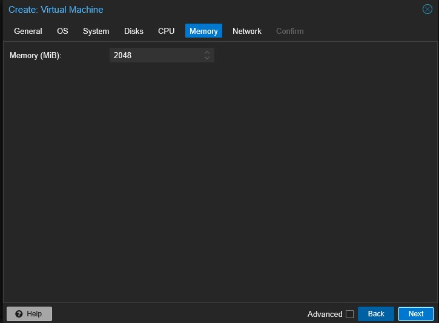


Seguidamente en la configuración de red podemos escoger si la máquina debe disponer de FW o no, entre otras configuraciones las cuales recomiendo no modificar:


Una vez configurados los pasos anteriores, podremos visualizar la configuración predefinida para nuestra VM en la siguiente ventana:

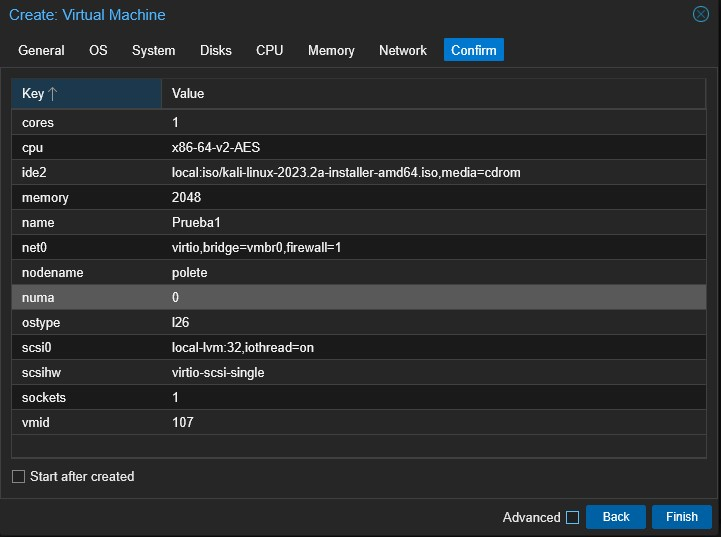


Si le damos a **Finish** la VM se creará y podremos ejecutarla.

Finalmente podremos ver nuestra máquina creada dentro de nuestro nodo:

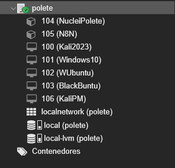


## Creación de un contenedor (LXC)

Para crear un contenedor en Proxmox, los pasos son muy similares a los de crear una máquina virtual dentro de nuestro nodo.

**Paso 1:**
Accedemos a nuestro nodo de Proxmox


**Paso 2:**

Accedemos a la sección de Create CT:


**Paso 3:**

Se nos abrirá una ventana, similar a la de la creación de VM, pero un poco distinta:

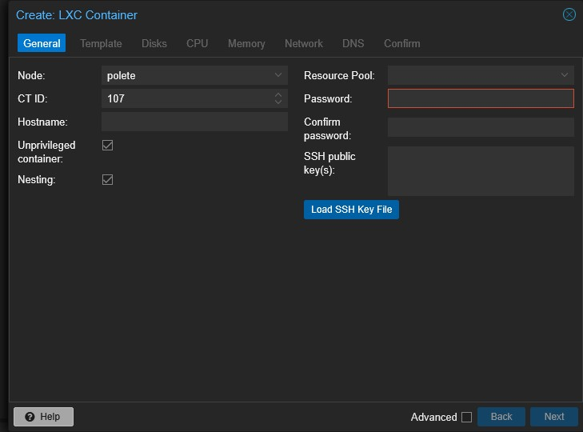


Aquí debemos configurar el hostname para nuestro contenedor y una contraseña para poder acceder al entorno.
Si se precisa, se puede configurar una clave pública mediante SSH que debemos cargar mediante *Load SSH Key File*

**Paso 4:**

Configurar plantilla del LXC

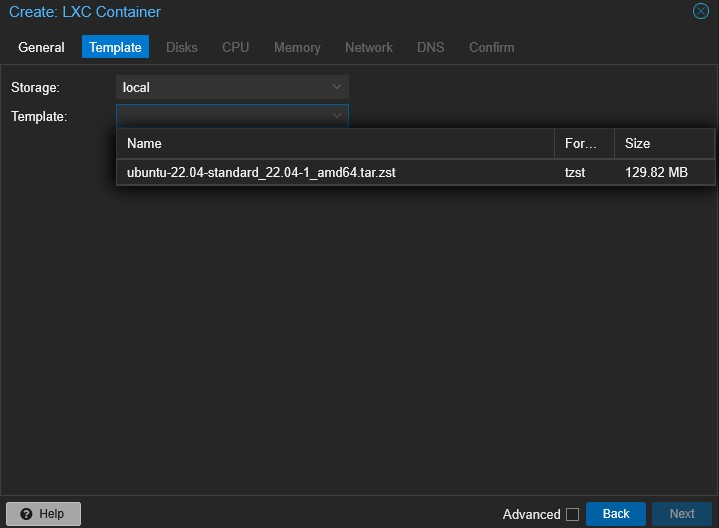


En este caso, solo podemos escoger como plantilla la que se visualiza en pantalla, debido a que LXC dentro de proxmox solo puede correr mediante esa plantilla.

**Paso 5:**

Seguidamente configuramos el almacenamiento de nuestro LXC, al ser un contenedor que ofrecerá servicios dedicados, no se precisa asignar tanto almacenamiento como en una Máquina Virtual.

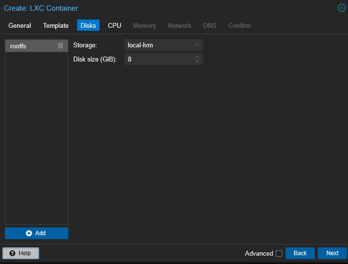


**Paso 6:**

En este paso, debemos configurar los cores que queremos que tenga nuestro LXC, teniendo en cuenta los núcleos de los que dispone nuestro procesador y los que queramos asignar para este contenedor:

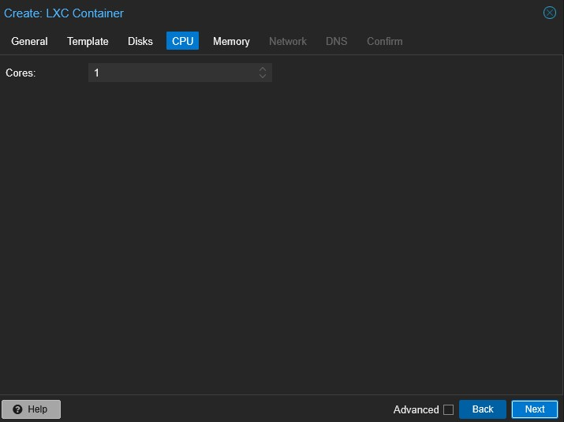


**Paso 7:**

Ahora configuramos la memoria RAM, tal y como lo hemos hecho en la sección de creación de una VM:

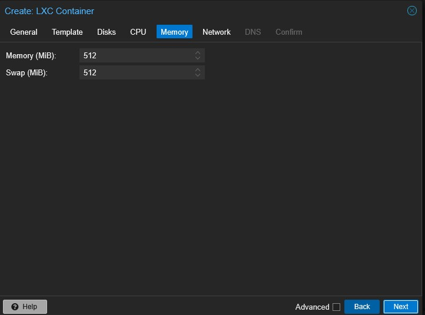


**Paso 8:**

Seguidamente configuramos los parámetros de red, si queremos que nuestro LXC disponga de una IP estática o se asigne una IP mediante el DHCP de nuestro router, debemos configurarlo correctamente.
**Recomiendo que se asigne mediante DHCP**

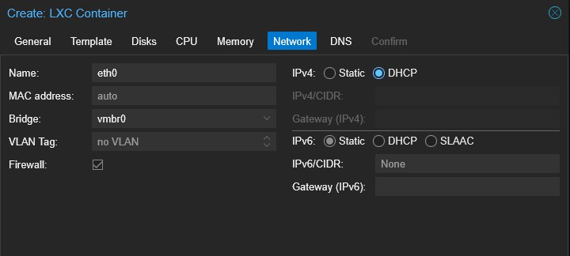


**Paso 9:**

Seguidamente configuramos los servidores DNS a los que se conectará el contenedor, principalmente recomiendo usar los DNS de Google, esto ya es a elección propia.

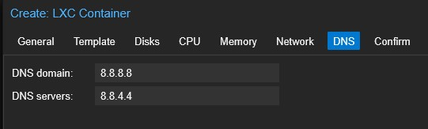


**Paso 10:**

Finalmente se nos mostrará una ventana con todas las configuraciones seleccionadas para la creación de nuestro LXC:

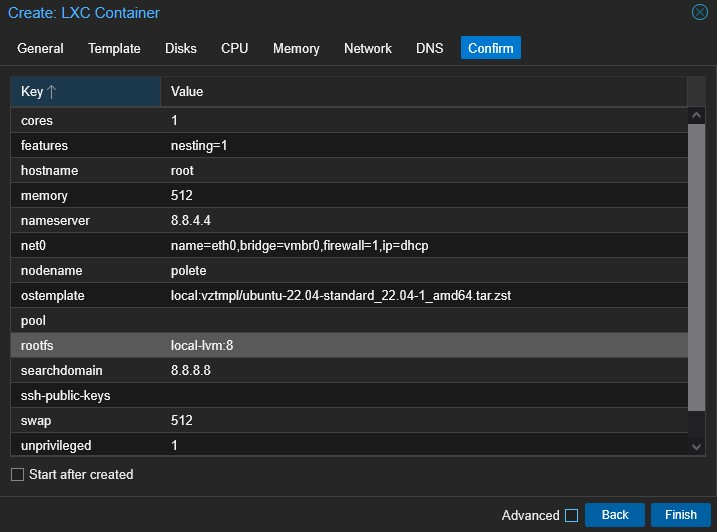


Si le damos a finalizar, se configurará y creará nuestro LXC, una vez creado podremos visualizarlo en nuestro nodo.


# 4. Almacenamiento y redes

## Tipos de almacenamiento soportados (LVM,ZFS,CEPH,NFS,etc.)

Proxmox VE ofrece una variedad de opciones de almacenamiento para adaptarse a diferentes necesidades empresariales. A continuación, se presentan los tipos más comunes:

### LVM (Logical Volume Manager)

LVM es un sistema de gestión de volúmenes lógicos que permite una administración flexible del almacenamiento en servidores físicos.

 ✅ **VENTAJAS:**
- Permite redimensionar volúmenes sin afectar los datos.
- Mejora la gestión del almacenamiento al crear volúmenes lógicos sobre discos físicos o arreglos RAID.
- Compatible con snapshots cuando se usa una combinación con LVM-Thin.

❌ **CONSIDERACIONES:**
- No ofrece redundancia de datos por sí mismo (Se recomienda RAID)
- No es ideal para entornos con alta demanda de snapshots

 🎯**USO RECOMENDADO:** Es ideal para servidores con almacenamiento local en discos duros o SSDs proporcionando flexibilidad en la gestión de volúmenes.

### ZFS (Zettabyte File System)

ZFS es un sistema de archivos avanzado con soporte de volúmenes que incluye funcionalidades de RAID, compresión y snapshots nativos.

✅ **VENTAJAS:**
- Protección contra corrupción de datos gracias a su sistema de checksums.
- Soporte nativo para snapshots y clones.
- Integración con RAID-Z, eliminando la necesidad de hardware RAID.
- Excelente rendimiento en lectura y escritura con SSDs y caché de memoria RAM.

❌ **CONSIDERACIONES:**
- Alto consumo de memoria RAM (se recomienda al menos **8 GB de RAM**, preferiblemente más para grandes volúmenes).
- Puede requerir ajustes para optimizar el rendimiento en entornos de alta carga.

🎯**USO RECOMENDADO:** Ideal para entornos que requieren integridad de datos, snapshots frecuentes y administración simplificada sin necesidad de RAID por hardware.


### Ceph (Clustered Storage)

Ceph es un sistema de almacenamiento distribuido que proporciona almacenamiento escalable y tolerante a fallos para grandes infraestructuras.

✅ **VENTAJAS:**
- Alta disponibilidad y redundancia de datos (replicación automática).
- Escalabilidad sin interrupciones al agregar más nodos de almacenamiento.
- Integración nativa con Proxmox VE para máquinas virtuales y contenedores.
- Soporte para almacenamiento en bloques, objetos y sistemas de archivos distribuidos.

❌ **CONSIDERACIONES:**
- Requiere al menos **tres nodos** para garantizar redundancia y alta disponibilidad.
- Mayor complejidad de configuración y mantenimiento en comparación con soluciones locales.

🎯**USO RECOMENDADO:** Perfecto para empresas con infraestructuras grandes que buscan almacenamiento distribuido, tolerante a fallos y escalable.


### NFS (Network File Storage)

NFS es un protocolo de almacenamiento en red que permite a múltiples servidores acceder a un sistema de archivos remoto como si fuera local.

✅ **VENTAJAS:**
- Fácil integración con Proxmox VE.
- Permite compartir almacenamiento entre varios nodos sin replicación de datos local.
- Ideal para backups centralizados y almacenamiento compartido de imágenes ISO o plantillas.

❌ **CONSIDERACIONES:**
- Dependencia de la red (rendimiento puede verse afectado por latencia).
- No ofrece redundancia de datos por sí mismo (recomendable combinar con RAID o snapshots en el servidor NFS).

🎯 **USO RECOMENDADO:** Excelente para almacenamiento compartido de máquinas virtuales, backups y entornos donde la disponibilidad de almacenamiento en red es clave.


### Conclusiones

Cada tipo de almacenamiento en Proxmox VE tiene ventajas y desventajas según las necesidades que se precisen. Para una solución óptima:
- **LVM** es ideal para almacenamiento local básico con flexibilidad.
- **ZFS** es perfecto para entornos que requieren integridad de datos y snapshots frecuentes.
- **Ceph** es la mejor opción para almacenamiento distribuido con alta disponibilidad.
- **NFS** es una excelente solución para almacenamiento compartido y backups centralizados.

🎯 **RECOMENDACIÓN:** La elección del almacenamiento debe basarse en factores como el rendimiento, redundancia, escalabilidad y facilidad de administración, según los objetivos de la empresa.


## Redes Virtuales en Proxmox VE

Proxmox VE ofrece una gestión avanzada de redes virtuales, permitiendo configurar distintos tipos de redes según las necesidades del entorno. La flexibilidad de sus sistema de red permite integrar máquinas virtuales (VMs) y contenedores (LXCs) de manera eficiente y segura.


### Linux Bridge (vmbrX)

Un **Linux Bridge** actúa como un switch virtual, permitiendo que múltiples VMs y CTs compartan una conexión de red.

✅ **VENTAJAS:**
- Funciona como un switch virtual, permitiendo comunicación entre VMs y con la red física.
- Fácil configuración y compatibilidad con múltiples interfaces físicas.
- Permite agregar reglas de firewall y configuración avanzada con **iptables**.

⚙ **Ejemplo de configuración en `/etc/network/interfaces`:**

```auto vmbr0
iface vmbr0 inet static
    address 192.168.1.100
    netmask 255.255.255.0
    gateway 192.168.1.1
    bridge_ports eth0
    bridge_stp off
    bridge_fd 0
```

💡 **Uso recomendado:** Configuración estándar para la mayoría de los entornos empresariales, permitiendo que VMs y CTs accedan a la red como si estuvieran conectadas a un switch físico.

### VLANs (Virtual LANs)

Las VLANs permiten segmentar el tráfico de red dentro del mismo switch físico o virtual, mejorando la seguridad y organización de la red.

✅ **VENTAJAS:**
- Separación lógica del tráfico sin necesidad de hardware adicional.
- Mejora la seguridad y reduce la congestión en redes grandes.
- Compatible con switches físicos y routers que soporten VLAN tagging (IEEE 802.1Q).

⚙ **Ejemplo de configuración en `/etc/network/interfaces`:**

```
auto vmbr0.10
iface vmbr0.10 inet static
    address 192.168.10.1
    netmask 255.255.255.0
    vlan-raw-device vmbr0
```

🎯 **USO RECOMENDADO:** Ideal para empresas que requieren segmentación de red para separar tráfico de departamentos o servicios (por ejemplo, producción, pruebas, administración).

### Bonding (Agregación de enlaces - NIC Teaming)

El bonding permite combinar varias interfaces de red físicas en una sola para mejorar **rendimiento** y **redundancia**.

✅ **VENTAJAS:**
- Mayor ancho de banda al sumar múltiples interfaces físicas.
- Tolerancia a fallos: si una interfaz falla, el tráfico continúa por las demás.
- Compatible con switches gestionados que soporten **LACP (Link Aggregation Control Protocol)**.

⚙ **Ejemplo de configuración de Bonding en `/etc/network/interfaces`:**

```
auto bond0
iface bond0 inet manual
    bond-slaves eth0 eth1
    bond-mode 802.3ad
    bond-miimon 100
    bond-lacp-rate 1
    bond-xmit-hash-policy layer2+3

auto vmbr0
iface vmbr0 inet static
    address 192.168.1.100
    netmask 255.255.255.0
    gateway 192.168.1.1
    bridge_ports bond0
    bridge_stp off
    bridge_fd 0
```

🎯 **USO RECOMENDADO:** Empresas con necesidades de alta disponibilidad y rendimiento en su red, especialmente en entornos con servidores de almacenamiento y bases de datos.

### SDN (Software Defined Network)
Desde Proxmox VE 7.x, se ha incorporado **SDN**, una solución avanzada que permite gestionar redes definidas por software para entornos complejos y multi-tenant.

✅ **VENTAJAS:**
- Reducción de dependencia de hardware de red.
- Creación de redes virtuales dinámicas y flexibles.
- Compatibilidad con Open vSwitch y VXLAN para redes privadas escalables.

🎯**USO RECOMENDADO:** Ideal para proveedores de servicios, centros de datos y grandes infraestructuras con múltiples usuarios y entornos aislados.

### Conclusión

Proxmox VE proporciona varias opciones de configuración de rd para adaptarse a distintos entornos: 

-  **Linux Bridge** → Configuración estándar, similar a un switch virtual.  
-  **VLANs** → Segmentación lógica de redes para mayor seguridad y organización.  
-  **Bonding** → Mayor rendimiento y redundancia mediante múltiples interfaces físicas.  
-  **SDN** → Red definida por software para infraestructuras avanzadas y multi-tenant.


# 5. Alta disponibilidad y Clustering

## Configuración de un Cluster

### ¿Qué es un cluster en Proxmox VE?

Un **cluster en Proxmox VE** es un grupo de **nodos** (servidores físicos) que trabajan juntos para administrar recursos de virtualización de manera centralizada. Esto permite funcionalidades avanzadas como:

-  **Migración en vivo** de máquinas virtuales sin interrupciones.  
-  **Alta disponibilidad (HA)** para minimizar el tiempo de inactividad.  
-  **Gestión unificada** de múltiples servidores desde una sola interfaz web.  
-  **Escalabilidad**, agregando más nodos según las necesidades.


### Requisitos previos para crear un cluster

Antes de iniciar la configuración de un cluster, es muy importante tener el cuenta los siguientes requisitos:

-  **Múltiples servidores con Proxmox VE instalado** (mínimo 2, recomendado 3 o más para HA).  
-  **Red confiable y de baja latencia** (preferiblemente una red de 10 Gbps para evitar problemas de sincronización).  
-  **Tiempo sincronizado entre los nodos** (usar **NTP** es crucial).  
-  **Almacenamiento compartido (NFS, Ceph, iSCSI, etc.)** si se usará Alta Disponibilidad.

### Paso a paso: Creación de un cluster en Proxmox VE

#### Paso 1: Configurar la red y nombres de Host

Cada nodo en Proxmox VE debe tener una IP estática y los nombres deben resolverse correctamente. 
Se recomienda configurar el archivo **/etc/hosts** dentro de cada nodo.

Para acceder a la consola de un nodo en Proxmox debemos hacerlo desde aquí:
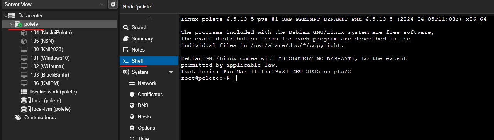


En mi caso dispongo de un solo nodo, pero si queremos crear un nuevo nodo y queremos que se comuniquan entre sí es importante configurar el archivo /etc/hosts añadiendo la dirección IP de cada Cluster

#### Paso 2: Crear un cluster desde el nodo principal

Debemos acceder al nuestro nodo principal y en la consola ejecutar el siguiente comando: ```
```
pvecm create nombre_cluster
```

Esto creará el cluster con el nombre del cluster que nosotros le asignemos y generará los archivos de configuración en **/etc/pve/**

Para verificar el estado del cluster:
```
pvecm status
```

#### Paso 3: Agregar Nodos al cluster

Desde los otros nodos, debemos ejecutar el siguiente comando para unirlo al cluster:
```
pvecm add <IP-NODO-PRINCIPAL>
```

Seguidamente se nos solicitará la contraseña del usuario root del nodo principal y se sincronizarán los datos.

Para ver los nodos existentes y sus conexiones:

```
pvecm nodes
```

#### Paso 4: Habilitar y configurar el Corosync

Corosync es un serviico que permite mantener la comunicación entre los nodos existentes. Su configuración se puede ver en:

```
systemctl status corosync
```

Si queremos aumentar la tolerancia a errores o fallos, se recomienda usar una segunda interfaz de red dedicada a Corosync, esto mejorará la estabilidad del cluster en caso de alguna interrupción en la red principal.

Si queremos configurar dos interfaces, accedemos al archivo **corosync.conf** y añadimos lo siguiente:

```
nodelist {
  node {
    name: proxmox-node1
    nodeid: 1
    ring0_addr: 192.168.1.101
    ring1_addr: 10.10.10.101
  }
  node {
    name: proxmox-node2
    nodeid: 2
    ring0_addr: 192.168.1.102
    ring1_addr: 10.10.10.102
  }
}
```

**Estas IP son a modo ejemplo, es importante introducir las del nodo que se este configurando en el momento, sino fallará la creación de las dos interfaces**

#### Paso 5: Migración de una VM de un nodo a otro

Para comprobar que realmente el cluster está bien creado, vamos a probar a migrar una VM de un nodo a otro:

```
qm migrate <ID_VM> <NOMBRE-NODO-DESTINO> --online
```

Ejemplo:
```
qm migrade 107 polete --online
```


Crear un Cluster en Proxmox VE implica tener una alta disponibilidad, escalabilidad y gestión centralizada de la infraestructura.
Crear un cluster en Proxmox VE nos permite:
- Migrar en vivo VMs sin interrupción
- Mejorar la redundancia y reducción de tiempos de inactividad
- Gestión simple desde la interfaz web de Proxmox
- Compatibilidad con almacenamiento compartido como **Ceph, NFS o iSCSI.**

## Alta disponibilidad (HA) y migración de VMs

### ¿Qué es la alta disponiblidad (HA)?

La **Alta Disponibilidad (HA)** en Proxmox VE permite que las máquinas virtuales (VMs) y contenedores (CTs) sigan funcionando automáticamente en caso de fallo de un nodo.

En un entorno **tradicional**, si un servidor físico falla, todas las VMs alojadas en él quedan inaccesibles. Con **HA en Proxmox VE**, el sistema detecta el fallo y **reanuda automáticamente las VMs en otro nodo disponible**, minimizando el tiempo de inactividad.

Los principales beneficios de HA en Proxmox VE son:
- **Protección contra fallos de hardware**: Si un nodo falla, las VMs se reinician en otro nodo disponible.
- **Gestión automática**: No requiere intervención manual en caso de fallo.
- **Integración nativa** con el sistema de clustering de Proxmox.
- **Máxima continuidad del negocio** y reducción de interrupciones.

### Requisitos previos para configurar HA en Proxmox VE

Antes de habilitar HA en Proxmox VE es muy importante cumplir con los siguientes requisitos:

-  **Cluster Proxmox VE configurado** con al menos **tres nodos**.  
-  **Almacenamiento compartido** (Ceph, NFS, iSCSI, etc.) para que todas las VMs sean accesibles desde cualquier nodo.  
-  **Quorum activo** en el cluster para evitar problemas de aislamiento.  
-  **Red estable y de baja latencia** para evitar falsos positivos en la detección de fallos.

### Configuración de HA en Proxmox VE

#### Paso 1: Verificar el estado del cluster

Antes de activar HA en Proxmox VE, debemos comprobar qué el cluster este funcionando correctamente:

```
pvecm status
```

Los nodos activos deben mostrar en estado **"online"** .

#### Paso 2: Agregar los nodos al grupo de HA

Se debe crear un grupo HA para definir qué nodos pueden alojar VMs en caso de fallo.

Desde la consola de uno de los nodos, escribimos lo siguiente:

```
ha-manager add-group ha-cluster --nodes proxmox-node1,proxmox-node2,proxmox-node3
```

Para verificar la creación del grupo HA:

```
ha-manager status
```

#### Paso 3: Habilitar Alta Disponibilidad para una VM o un LXC

Para añadir una máquina virtual al grupo o sistema de HA, escribimos lo siguiente:

```
ha-manager add vm:<ID_VM> --group <NOMBRE_GRUPO_HA>
```

Desde la interfaz gráfica de Proxmox:

1. Ir a **Datacenter → HA**.
2. Hacer clic en **Add** y seleccionar la VM o CT que deseas proteger.
3. Asignarla al **grupo de HA** creado.
4. Seleccionar la política de reinicio automático.

Ahora debemos verificar que la VM esté en la lista de HA con:

```
ha-manager status
```


### Migración de VMs

La **migración de VMs** es una funcionalidad clave en clusters de Proxmox VE. Permite mover una máquina virtual de un nodo a otro **sin detenerla** (**Live Migration**) o con una breve interrupción (**Offline Migration**).

#### Migración en Vivo (Live Migration)

Este método de migración se usa para mover VMs sin tiempo de inactividad y solo es posible si la VM está en **almacenamiento compartido**

Para migrar una VM en vivo desde la línea de comandos desde nuestro nodo principal:

```
qm migrate <ID_VM> <NOMBRE_NODO> --online
```

O desde la interfaz gráfica:

1. Seleccionar la VM.
2. Hacer clic en **Migrate**.
3. Elegir el nodo de destino.
4. Iniciar la migración sin detener la VM.

#### Migración Offline (Cold Migration)

Este método de migración se usa cuando la VM está en almacenamiento local en un nodo y es importante que la VM este apagada antes de migrarla.

Comando para migrar la VM apagada:

```
qm migrate <ID_VM> <NOMBRE_NODO>
```


#### Diferencias entre HA y Live Migration

| Características                    | Alta Disponiblidad (HA)          | Live Migration                      |
| ---------------------------------- | -------------------------------- | ----------------------------------- |
| Objetivo                           | Recuperar VMs tras un fallo      | Mover VMs entre nodos sin apagarlas |
| Tiempo de Inactividad              | Casi nulo (Pero hay un reinicio) | Ninguno                             |
| Requiere cluster                   | SI                               | SI                                  |
| Requiere almacenamiento compartido | SI                               | SI                                  |
| Automático / Manual                | Automático                       | Manual                              |
| Óptimo para                        | Protección Ante Fallos           | Mantenimiento sin Cortes            |

Alta Disponibilidad y Migración de VMs en Proxmox VE** son funciones clave para infraestructuras empresariales que buscan máxima estabilidad y mínimo tiempo de inactividad

- Alta Disponibilidad (HA) garantiza que si un nodo falla, las VMs se reinicien en otro nodo sin intervención manual.  
- Live Migration permite mover VMs entre nodos **sin interrupciones**, ideal para mantenimiento de servidores.  
- Ambas funcionalidades juntas** permiten una **infraestructura robusta**, resistente a fallos y con alta flexibilidad.

**RECOMENDACIÓN:** Implementar HA en clusters con **tres o más nodos**, usar **almacenamiento compartido** y asegurar una **red rápida y confiable** para maximizar el rendimiento.


# 6. Seguridad y administración

## Usuarios, roles y permisos

Promxox VE cuenta con un sistema **robusto y flexible de gestión de usuarios y permisos**, permitiendo a los administradores asignar roles específicos según las necesidades de seguridad y administración.

Esto es clave para:
- Restringir accesos innecesarios y proteger la infraestructura
- Delegar responsabilidades de manera controlada
- Garantizar el cumplimiento de buenas prácticas de seguridad

#### Usuarios 

Un **usuario** en Proxmox es una cuenta con credenciales que permiten el acceso a la plataforma. Se pueden autenticar mediante diferentes métodos:

- **Linux PAM** (`pam`) → Autenticación local basada en usuarios del sistema.  
- **Proxmox VE Authentication Server** (`pve`) → Usuarios gestionados dentro de Proxmox sin dependencia del sistema.  
- **Active Directory / LDAP** (`ldap`) → Integración con directorios empresariales para autenticación centralizada.  
- **OpenID / SSO** (`openid`) → Integración con proveedores de identidad como Google, Microsoft o Keycloak.

##### Crear un Usuario en la Interfaz Web

1. Ir a **Datacenter → Permissions → Users**.
2. Hacer clic en **Add**.
3. Ingresar el **nombre de usuario**, dominio (`pam`, `pve`, `ldap`), y tipo de autenticación.
4. Asignar un **rol**.
5. Guardar los cambios.

##### Crear un Usuario desde la Línea de Comandos

```
pveum user add usuario@pve --password MiContraseñaSegura
```

#### Roles

Un rol define los permisos que tiene un usuario dentro del sistema. Proxmox incluye roles predefinidos, pero también se pueden crear roles personalizados.

| Rol               | Descripción                                                                       |
| ----------------- | --------------------------------------------------------------------------------- |
| Administrador     | Acceso total a todo el sistema                                                    |
| NoAccess          | Bloquea el accesso (útil para revocar permisos temporalmente)                     |
| PVEAdmin          | Permite administrar Proxmox, pero sin acceso a configuración de usuarios ni redes |
| PVEUser           | Puede iniciar/detener VMS y ver recursos, pero no modificarlos                    |
| PVEDatastoreAdmin | Puede gestionar almacenamiento, backups y snapshots                               |
| PVEDatastoreUser  | Puede ver almacenamiento pero no modificarlo                                      |
| PVEMonitor        | Solo acceso de lectura para monitoreo del sistema                                 |
##### Asignar un rol a un usuario desde la Interfaz Web

1. Ir a datacenter - Permissions - Users
2. Seleccionar el usuario
3. Hacer click en Modify y asingar el rol deseado

##### Asignar un rol a un usuario desde la línea de comandos

```
pveum acl modify / -user usuario@pve -role PVEUser
```

#### Permisos en Proxmox VE

Los **permisos** en Proxmox definen qué acciones puede realizar un usuario sobre un **objeto** específico (VMs, contenedores, almacenamiento, etc.).

##### Estructura de permisos en Proxmox VE

Los permisos se asignan en una estructura jerárquica de objetos:

📂 **Datacenter** → Contiene todos los nodos y recursos.  
📍 **Nodo** (`/nodes/nodo1`) → Servidores individuales dentro del cluster.  
📦 **Máquina Virtual** (`/qemu/100`) → VMs específicas.  
🗄 **Almacenamiento** (`/storage/local`) → Espacios de almacenamiento.

###### Asignar un permiso a un usuario en un nodo específico

```
pveum acl add /nodes/proxmox-node1 -user usuario@pve -role PVEUser
```

###### Revocar un permiso a un usuario

```
pveum acl delete /nodes/proxmox-node1 -user usuario@pve -role PVEUser
```


## Actualización y mantenimiento del sistema

El mantenimiento y actualización regular de Proxmox VE es fundamental para asegurar un entorno seguro, estable y optimizado. Esto incluye la instalación de parches de seguridad, nuevas versiones del sistema y monitoreo continuo para prevenir problemas antes de que ocurran.

### Importancia de mantener Proxmox actualizado

✅ **Seguridad** → Se corrigen vulnerabilidades y se refuerza la protección contra amenazas.  
✅ **Rendimiento** → Se optimizan recursos y se mejoran tiempos de respuesta del sistema.  
✅ **Compatibilidad** → Se garantiza la compatibilidad con hardware y nuevas funciones.  
✅ **Corrección de errores (bug fixes)** → Se solucionan fallos detectados en versiones anteriores.


### Configuración correcta de los repositorios 

Proxmox VE tiene **tres tipos de repositorios**:

 - **Enterprise Repository (`pve-enterprise`)** → Solo disponible para suscriptores de Proxmox.  
 - **No-Subscription Repository (`pve-no-subscription`)** → Gratuito, pero sin garantía de estabilidad.  
 - **Test Repository (`pvetest`)** → Para pruebas y desarrollo, **no recomendado en producción**.

#### Configurar un repositorio gratuito pve-no-subscription

Si no se dispone de una suscripción empresarial, debemos editar el archivo de repositorios:

```
nano /etc/apt/sources.list.d/pve-enterprise.list
```

Y debemos comentar la siguiente línea del repositorio empresarial:

```
# deb https://enterprise.proxmox.com/debian/pve bookworm pve-enterprise
```

Seguidamente debemos agregar el repositorio gratuito:

```
echo "deb http://download.proxmox.com/debian/pve bookworm pve-no-subscription" > /etc/apt/sources.list.d/pve-no-subscription.list
```

Finalmente debemos actualizar la lista de paquetes para que se apliquen las configuraciones previas:

```
sudo apt update
```

### Actualización de Proxmox VE

#### Paso 1: Verificar la versión actual de proxmox

```
pveversion -v
```

#### Paso 2: Actualizar paquetes del sistema

```
apt update && apt dist-upgrade -y
```

#### Paso 3: Verificar que todo funciona correctamente

Después de reiniciar el sistema, revisamos el estado del cluster y servicios:

```
pvecm status  # Verifica el cluster
systemctl status pve-cluster pvedaemon pveproxy  # Verifica servicios clave
```

### Mantenimiento preventivo de Promxox VE

Realizar un mantenimiento regular sobre nuestro Proxmox VE ayuda a evitar problemas.

A continuación se listan varias recomendaciones de mantenimiento para evitar problemas a futuro en nuestro entorno:

#### Monitorear el estado del sistema

Se recomienda revisar con frecuencia el uso de CPU, RAM y almacenamiento de nuestro Proxmox VE.

Para evaluar el rendimiento del sistema desde CLI:

```
pveperf
```

#### Gestionar espacio en disco

Revisar el uso de almacenamiento con:

```
df -h
```

#### Verificar la salud de los discos

```
smartctl -a /dev/sdX
```

#### Rotación de logs para evitar saturación en disco

Revisar y limpiar logs grandes en **/var/log/:**

```
journalctl --vacum-size=500M
```

#### Conclusión

El mantenimiento y la actualización de Promxox VE es crítico para garantizar la estabilidad y seguridad del sistema. Se recomienda:
- **Actualizar regularmente** para corregir vulnerabilidades y mejorar el rendimiento.  
-  **Configurar correctamente los repositorios** para evitar problemas de compatibilidad.  
-  **Realizar mantenimiento preventivo** para evitar saturación de recursos.  
-  **Implementar buenas prácticas de seguridad** para proteger la infraestructura.
